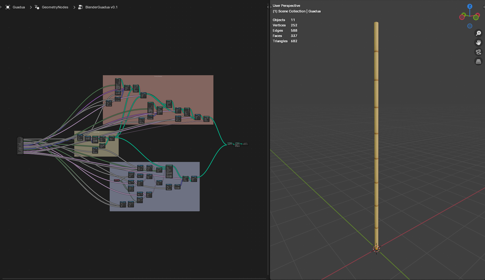

# BlenderGuadua
## v0.1 | 11.07.2024

Setup de GeometryNodes en Blender para crear guaduas y bambúes paramétricos. Incluye opciones para controlar:
- Largo y el ancho de la guadua.
- Número de nodos.
- Cortes (con profundidad y ángulo).
- Extrusión (espesor de la guadua).
- Material básico.

## Cómo usar:
- Agregar el archivo .blend a la carpeta de Catálogo de Recursos (Asset Library).
- Agregar el setup de Geometry Nodes a una geometría.

## [Video Tutorial]()
